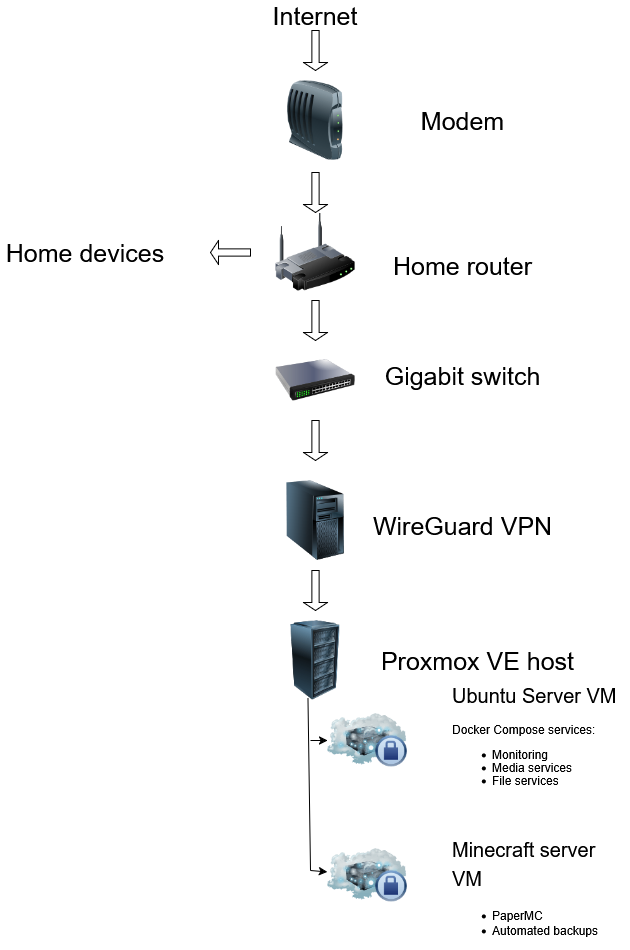

# Homelab
My own homelab project, currently ongoing and expanding, built for learning Linux system administration,
virtualization and container orchestration.

---

## Infrastructure

---

## Technologies

- Proxmox VE
- Ubuntu Server
- Docker & Docker Compose
- WireGuard VPN
- Linux
- Virtual Machines

---

## Services

### Ubuntu Server VM

Docker Compose services

- Monitoring
- Media services
- File services

### Minecraft Server VM

- PaperMC
- Automated backups

---

## Goals

- Learn virtualization
- Learn Docker
- Learn Linux administration
- Learn networking
- Build a reliable self-hosted environment
